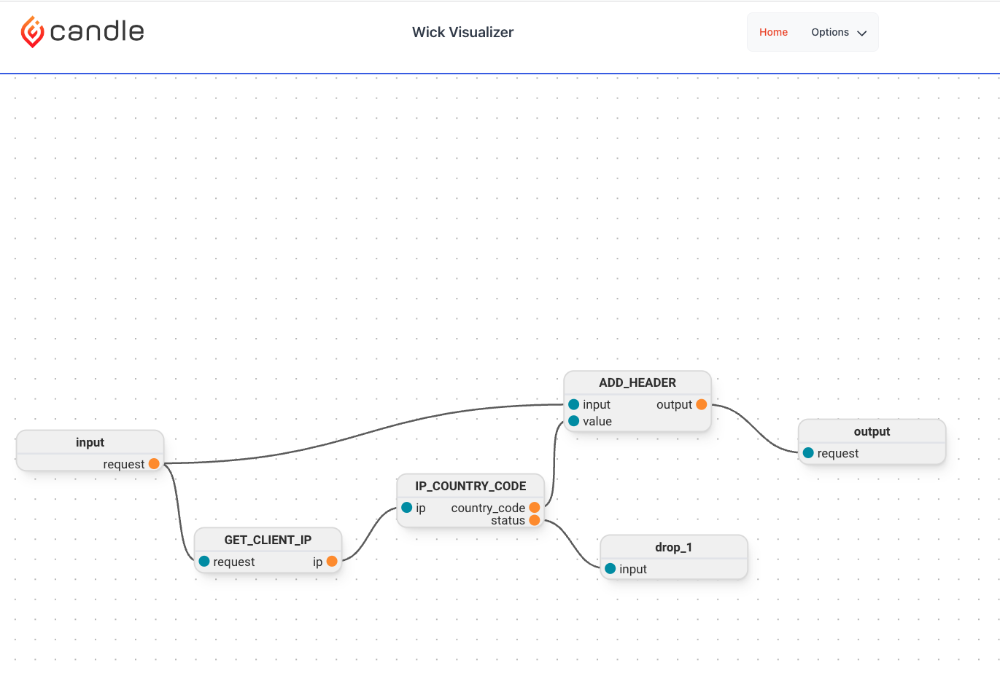

This blog series will walk through the process of building a HTTP proxy, using the Wick framework, that will use the [https://pangea.cloud] (Pangea Cloud API) to enrich the request with the user's location and then forward the request to the appropriate server.

This will allow any existing service to be location aware without having to change the source code of service itself. This proxy can be run as a sidecar or in kubernetes or as a standalone service or ingress for adding the location data for multiple services.

## What is Wick?

Wick is an opinionated framework for building applications. It brings Hexagonal Architecture and WebAssembly together to make it easy to build and deploy maintainable applications. If you are not familar with Hexagonal Architecure, [https://youtu.be/bDWApqAUjEI] (this is a really informative video).

With Wick, you are in full control of the resources that you application can access and all code is executed in a sandbox. With these security guarantees, we are moving the world to a future where sourcecode does not matter. This will be especially important as AI generated code becomes more prevelant. We need the ability to run code without having to trust the source. That is what Wick is fundamentally about.

You can learn more about Wick at [https://candle.dev/docs] (https://candle.dev/docs) and view the source code and examples on [https://github.com/candlecorp/wick] (Github). In short, Wick is like an orchestrator and service mesh for the functions inside an application.

## What is the point of this blog series?

There are multiple points that will be showcased here:

- It is possible to build practical application using WebAssembly on the server side. If you are instersted in more disucssions around "Practical WebAssembly", check out [https://podcasts.apple.com/fi/podcast/practical-webassembly/id1648496119?ign-itscg=30200&ign-itsct=podtail_podcasts] (our podcast)!
- The same component can be reused without ever having to be being recompiled. This can be run as a CLI tool or a service or a sidecar.
- Security can be an enabler in software development.
- Wick is a great framework for building applications.
- The Pangea Cloud API is a great set of API's for adding security into your applications.

## What the final middleware will look like



## What we are building today

## Getting started

If you want to follow along, you will need to install Wick. You can do that by running the following command:

- OSX / Linux: `curl -sSL sh.wick.run | bash`
- Windows (Powershell): `curl https://ps.wick.run -UseBasicParsing | Invoke-Expression`

You can then run `wick --version` to verify that it is installed.

## Building the components

Pangea Cloud offers a rest-based API. We will first create a simple consumer of their IP Geolocation API.
In terminal, we run: `wick new component http pangea_api.wick`
This generates a boilerplate HTTP component that we can then modify to call the Pangea API.

Here is what the final component looks like:

```yaml
kind: wick/component@v1
name: pangea_api
metadata:
  version: 0.1.0
  description: New HTTP Client wick component
  licenses:
    - Apache-2.0
resources:
  - name: HTTP_URL
    resource:
      kind: wick/resource/url@v1
      url: "{{ ctx.root_config.url }}"
component:
  kind: wick/component/http@v1
  with:
    - name: token
      type: string
    - name: url
      type: string
  resource: HTTP_URL
  codec: Json
  operations:
    - name: ip_geolocate
      inputs:
        - name: ip
          type: string
      method: Post
      codec: Json
      path: /v1/geolocate
      headers:
        "Authorization": ["Bearer {{ ctx.root_config.token }}"]
        "Content-Type": ["application/json"]
      body:
        ip: "{{ ip }}"
```

The HTTP component has a few different sections: `resources`, `component`, and `operations`.

The `resources` section defines the resources that the component will use. In this case, we are defining a single resource, `HTTP_URL`, that is of type `wick/resource/url@v1`. This resource is used in the `component` section. Wick currently supports `url` and `dir` resources for exposing remote services and directories to the component. The component has no access to the outside world other than what is defined in the resources section.

The `component` section defines the component itself. The `with` section defines the inputs that the component will accept. In this case, we are defining two inputs, `token` and `url`, that are of type `string`. The `resource` section defines the resource that the component will use. In this case, we are using the `HTTP_URL` resource that we defined above. The `codec` section defines the codec that will be used to encode and decode the data. In this case, we are using `Json`.

The `operations` section defines the operations that the component will expose. In this case, we are defining a single operation, `ip_geolocate`, that takes a single input, `ip`, that is of type `string`. The `method` section defines the HTTP method that will be used. In this case, we are using `Post`. The `codec` section defines the codec that will be used to encode and decode the data. In this case, we are using `Json`. The `path` section defines the path that will be appended to the `url` resource. The `headers` section defines the headers that will be sent with the request. The `body` section defines the body that will be sent with the request.

You will see that in the `headers` block, we have exposed some variables using `Liquid` syntax. This allows us some flexibility on getting customized data into the component and allows for the component yaml to use variables.

## Testing the component

Sign up for a free account at [https://pangea.cloud] (https://pangea.cloud) and get an API token. Save the token and url as environment variables ` PANGEA_TOKEN`` and  `PANGEA_URL` You can then run the following command to test the component:

```bash
❯ wick invoke pangea_api.wick ip_geolocate --with="{\"token\": \"$PANGEA_TOKEN\", \"url\": \"$PANGEA_URL\"}" -- --ip="93.231.182.110"

{"payload":{"value":{"headers":{"access-control-allow-headers":["*"],"access-control-allow-methods":["*"],"access-control-allow-origin":["*"],"access-control-max-age":["86400"],"content-length":["382"],"content-type":["application/json"],"date":["Fri, 04 Aug 2023 15:39:52 GMT"],"server":["Pangea API Server"],"set-cookie":["AWSALB=yt1mpqgn5i1f4lRVAju3QY/naZMKtTJeWv60N1rEZuhL5KRExDDycyts0+gxCuPG5iNMmemmKQV8mxJ09uZAJ2cT22GFKRdN3W1uEtDu3D5c2IMCtuMrki+7OMta; Expires=Fri, 11 Aug 2023 15:39:52 GMT; Path=/","AWSALBCORS=yt1mpqgn5i1f4lRVAju3QY/naZMKtTJeWv60N1rEZuhL5KRExDDycyts0+gxCuPG5iNMmemmKQV8mxJ09uZAJ2cT22GFKRdN3W1uEtDu3D5c2IMCtuMrki+7OMta; Expires=Fri, 11 Aug 2023 15:39:52 GMT; Path=/; SameSite=None; Secure"],"x-pangea-server-id":["05c5ccf3-9fbc-4c63-8e69-8c8e4fcd5a76"],"x-ratelimit-limit":["1500"],"x-ratelimit-remaining":["1499"],"x-ratelimit-reset":["0"],"x-request-id":["prq_onblhssfsnr42arh6hby2nu6rnhqucw6"]},"status":"200","version":"2.0"}},"port":"response"}
{"payload":{"value":{"request_id":"prq_onblhssfsnr42arh6hby2nu6rnhqucw6","request_time":"2023-08-04T15:39:52.339697Z","response_time":"2023-08-04T15:39:52.367411Z","result":{"data":{"city":"unna","country":"Federal Republic Of Germany","country_code":"de","latitude":51.56,"longitude":7.65,"postal_code":"59425"}},"status":"Success","summary":"IP location found (Country: Federal Republic Of Germany)"}},"port":"body"}
```
