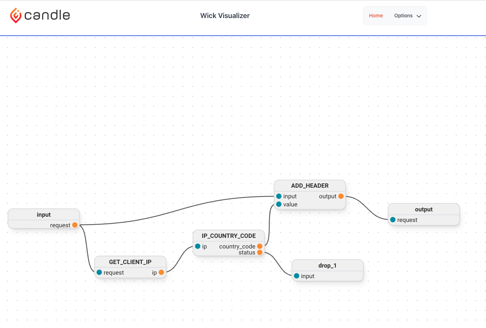

This blog will walk through the process of building a HTTP proxy, using Wick, that will use the [Pangea Cloud API](Pangea Cloud API) to enrich the request with the user's location and then forward the request to the appropriate server.

This will allow any existing service to be location aware without having to change the source code of service itself. This proxy can be run as a sidecar or in kubernetes or as a standalone service or ingress for adding the location data for multiple services.

Finally, we will install the same component as a CLI tool to show how the same component can be reused without ever having to be recompiled.

## What is Wick?

Wick is an opinionated framework for building applications. It brings Hexagonal Architecture and WebAssembly together to make it easy to build and deploy maintainable applications. If you are not familar with Hexagonal Architecure, [https://youtu.be/bDWApqAUjEI](this is a really informative video).

With Wick, you are in full control of the resources that you application can access and all code is executed in a sandbox. With these security guarantees, we are moving the world to a future where sourcecode does not matter. This will be especially important as AI generated code becomes more prevelant. We need the ability to run code without having to trust the source. That is what Wick is fundamentally about.

You can learn more about Wick at [https://candle.dev/docs](https://candle.dev/docs) and view the source code and examples on [https://github.com/candlecorp/wick](Github). In short, Wick is like an orchestrator and service mesh for the functions inside an application.

## What is the point of this blog series?

There are multiple points that will be showcased here:

- It is possible to build practical application using WebAssembly on the server side. If you are instersted in more disucssions around "Practical WebAssembly", check out [https://podcasts.apple.com/fi/podcast/practical-webassembly/id1648496119?ign-itscg=30200&ign-itsct=podtail_podcasts](our podcast)!
- The same component can be reused without ever having to be being recompiled. This can be run as a CLI tool or a service or a sidecar.
- Security can be an enabler in software development.
- Wick is a great framework for building applications.
- The Pangea Cloud API is a great set of API's for adding security into your applications.

## What we are building today

Today, we are building the `ip_country_code` component that receives an IP address and returns the country code for that IP address.

## Getting started

If you want to follow along, you will need to install Wick. You can do that by running the following command:

- OSX / Linux: `curl -sSL sh.wick.run | bash`
- Windows (Powershell): `curl https://ps.wick.run -UseBasicParsing | Invoke-Expression`

You can then run `wick --version` to verify that it is installed.

The complete source code for this project is available at [https://github.com/candlecorp/pangea-proxy](Github)

## Building the components

Pangea Cloud offers a rest-based API. We will first create a simple consumer of their IP Geolocation API.
In terminal, we run: `wick new component http pangea_api.wick`
This generates a boilerplate HTTP component that we can then modify to call the Pangea API.

Here is what the final component looks like:

```yaml
kind: wick/component@v1
name: pangea_api
metadata:
  version: 0.1.0
  description: New HTTP Client wick component
  licenses:
    - Apache-2.0
resources:
  - name: HTTP_URL
    resource:
      kind: wick/resource/url@v1
      url: "{{ ctx.root_config.url }}"
component:
  kind: wick/component/http@v1
  with:
    - name: token
      type: string
    - name: url
      type: string
  resource: HTTP_URL
  codec: Json
  operations:
    - name: ip_geolocate
      inputs:
        - name: ip
          type: string
      method: Post
      codec: Json
      path: /v1/geolocate
      headers:
        "Authorization": ["Bearer {{ ctx.root_config.token }}"]
        "Content-Type": ["application/json"]
      body:
        ip: "{{ ip }}"
```

The HTTP component has a few different sections: `resources`, `component`, and `operations`.

The `resources` section defines the resources that the component will use. In this case, we are defining a single resource, `HTTP_URL`, that is of type `wick/resource/url@v1`. This resource is used in the `component` section. Wick currently supports `url` and `dir` resources for exposing remote services and directories to the component. The component has no access to the outside world other than what is defined in the resources section.

The `component` section defines the component itself. The `with` section defines the inputs that the component will accept. In this case, we are defining two inputs, `token` and `url`, that are of type `string`. The `resource` section defines the resource that the component will use. In this case, we are using the `HTTP_URL` resource that we defined above. The `codec` section defines the codec that will be used to encode and decode the data. In this case, we are using `Json`.

The `operations` section defines the operations that the component will expose. In this case, we are defining a single operation, `ip_geolocate`, that takes a single input, `ip`, that is of type `string`. The `method` section defines the HTTP method that will be used. In this case, we are using `Post`. The `codec` section defines the codec that will be used to encode and decode the data. In this case, we are using `Json`. The `path` section defines the path that will be appended to the `url` resource. The `headers` section defines the headers that will be sent with the request. The `body` section defines the body that will be sent with the request.

You will see that in the `headers` block, we have exposed some variables using `Liquid` syntax. This allows us some flexibility on getting customized data into the component and allows for the component yaml to use variables.

## Checking the component

Sign up for a free account at [https://pangea.cloud] (https://pangea.cloud) and get an API token. Save the token and url as environment variables `PANGEA_TOKEN` and `PANGEA_URL` You can then run the following command to test the component:

```bash
❯ wick invoke pangea_api.wick ip_geolocate --with="{\"token\": \"$PANGEA_TOKEN\", \"url\": \"$PANGEA_URL\"}" -- --ip="93.231.182.110"

{"payload":{"value":{"headers":{"access-control-allow-headers":["*"],"access-control-allow-methods":["*"],"access-control-allow-origin":["*"],"access-control-max-age":["86400"],"content-length":["382"],"content-type":["application/json"],"date":["Fri, 04 Aug 2023 15:39:52 GMT"],"server":["Pangea API Server"],"set-cookie":["AWSALB=yt1mpqgn5i1f4lRVAju3QY/naZMKtTJeWv60N1rEZuhL5KRExDDycyts0+gxCuPG5iNMmemmKQV8mxJ09uZAJ2cT22GFKRdN3W1uEtDu3D5c2IMCtuMrki+7OMta; Expires=Fri, 11 Aug 2023 15:39:52 GMT; Path=/","AWSALBCORS=yt1mpqgn5i1f4lRVAju3QY/naZMKtTJeWv60N1rEZuhL5KRExDDycyts0+gxCuPG5iNMmemmKQV8mxJ09uZAJ2cT22GFKRdN3W1uEtDu3D5c2IMCtuMrki+7OMta; Expires=Fri, 11 Aug 2023 15:39:52 GMT; Path=/; SameSite=None; Secure"],"x-pangea-server-id":["05c5ccf3-9fbc-4c63-8e69-8c8e4fcd5a76"],"x-ratelimit-limit":["1500"],"x-ratelimit-remaining":["1499"],"x-ratelimit-reset":["0"],"x-request-id":["prq_onblhssfsnr42arh6hby2nu6rnhqucw6"]},"status":"200","version":"2.0"}},"port":"response"}
{"payload":{"value":{"request_id":"prq_onblhssfsnr42arh6hby2nu6rnhqucw6","request_time":"2023-08-04T15:39:52.339697Z","response_time":"2023-08-04T15:39:52.367411Z","result":{"data":{"city":"unna","country":"Federal Republic Of Germany","country_code":"de","latitude":51.56,"longitude":7.65,"postal_code":"59425"}},"status":"Success","summary":"IP location found (Country: Federal Republic Of Germany)"}},"port":"body"}
```

## Simplifying the response

The response payload is nested and for our usecase for our usecase, we want to just get the `country_code` portion and don't need the rest of the response.

```json
{
  "payload": {
    "value": {
      "request_id": "prq_ujgqrcrxm2s54sw3x43z7nisez5rhhzj",
      "request_time": "2023-08-07T19:04:47.274577Z",
      "response_time": "2023-08-07T19:04:47.299400Z",
      "result": {
        "data": {
          "city": "unna",
          "country": "Federal Republic Of Germany",
          "country_code": "de",
          "latitude": 51.56,
          "longitude": 7.65,
          "postal_code": "59425"
        }
      },
      "status": "Success",
      "summary": "IP location found (Country: Federal Republic Of Germany)"
    }
  },
  "port": "body"
}
```

For this, we will create a `composite` component. A composite component is a component that is made up of other components. In this case, we will create a component that uses the `pangea_api` component that we created above and then simplifies the response.

```yaml
kind: wick/component@v1
name: pangea
metadata:
  version: 0.3.0
  description: pangea component
  licenses:
    - Apache-2.0
package:
  registry:
    host: registry.candle.dev
    namespace: pangea
import:
  - name: pangea_api
    component:
      kind: wick/component/manifest@v1
      ref: ./pangea_api.wick
      with:
        token: "{{ ctx.root_config.token }}"
        url: "{{ ctx.root_config.url }}"
component:
  kind: wick/component/composite@v1
  with:
    - name: token
      type: string
    - name: url
      type: string
  operations:
    - name: ip_country_code
      flow:
        - <input>.ip -> pangea_api::ip_geolocate[GEO].ip
        - GEO.body.result.data.country_code -> <output>.country_code
        - GEO.response -> drop
    - name: ip_geolocate
      flow:
        - <input>.ip -> pangea_api::ip_geolocate[GEO].ip
        - GEO.body.result.data -> <output>.geolocation
        - GEO.response -> drop
```

If you look at the `operations`, you will see that we call the ip_geolocate component and then use the `->` operator to pipe the response from the component to the next operation. We use a simple dot based notation to parse the body object that is returned and return just a subset of the response. We then use the `drop` operator to drop the unused response components from the previous operation.

## "What if I wanted to do something more complex?"

If you had this question, I wanted to take some time to answer it directly. If you must write code becuase your application is complex then you are absolutely welcome to create a component that is coded (currently we support Rust) and then compiled to WebAssembly. You can then use that component as part of your flow to handle complex conditional logic, data transformations, etc. The beauty of Wick is that you never need to share your source code. The yaml manifest provides the interface to your component and Wick provides all of the security. It is impossible for a component to do more than what is defined in the manifest. You can read my blog post on [Linkedin](https://www.linkedin.com/pulse/source-code-does-matter-fawad-shaikh/) to understand why I believe that source code does matter.

I made a [WASM component](https://github.com/candlecorp/pangea-proxy/blob/main/pangea/src/lib.rs) so you can see what it takes to write your own component. You can read more about how to make a WASM component in our [documentation](https://candle.dev/docs/guide/components/wasmrs/)

But again, I am making a CLI app and a proxy middleware without writing or compiling any code. I am just using Wick to compose configurable components together. So let's get back to that.

## Checking the composite component

```bash
wick invoke pangea.wick ip_country_code --with="{\"token\": \"$PANGEA_TOKEN\", \"url\": \"$PANGEA_URL\"}" -- --ip="99.101.46.99"

{"payload":{"value":"us"},"port":"country_code"}
```

## Making a middlware component

In Wick, we have the concept of interface `types`. These are like structs that can be shared between applications to allow for simpler interfacing. We will use the `http` type to import the interface definition for a `HttpRequest` and `RequestMiddlewareResponse`. We will also import multiple other components and tie them together to make a complete flow for our middleware component.

`RequestMiddlewareResponse` is a type is a union return type of either HTTP request or a HTTP response. With Wick, a request handled by a middleware can return either a HTTP request or HTTP response.

## Connecting multiple components

To illustrate the process, let's break down the flow of our middleware into the following steps:

1. Get the client IP from the `HttpRequest` using the `http_client_ip` component
2. Pass the IP address to the `pangea` component to get the country code
3. Append a request header to the `HttpRequest` with the country code using the `http_headers` component
4. Return the modified `HttpRequest` as a `RequestMiddlewareResponse`.

Using our flow syntax, we pass the data between the components. The `->` operator is used to pass the output data from one component to the input data for the next. The `drop` operator is used to drop the data from the previous component so Wick does not expect for a component input to connect to that output. The `RequestMiddlewareResponse` is returned as the output of the middleware component.

````yaml

This is the result of the following YAML manifest:


```yaml
kind: wick/component@v1
name: middleware
metadata:
  version: 0.0.1
  description: middleware component for pangea
  licenses:
    - Apache-2.0
package:
  registry:
    host: registry.candle.dev
    namespace: pangea
import:
  - name: http
    component:
      kind: wick/component/types@v1
      ref: registry.candle.dev/types/http:0.4.0
  - name: pangea
    component:
      kind: wick/component/manifest@v1
      ref: registry.candle.dev/pangea/pangea:0.1.0
      with:
        token: "{{ ctx.root_config.token }}"
        url: "{{ ctx.root_config.url }}"
  - name: client_ip
    component:
      kind: wick/component/manifest@v1
      ref: registry.candle.dev/candle/http_client_ip:0.2.0
  - name: http_headers
    component:
      kind: wick/component/manifest@v1
      ref: registry.candle.dev/candle/http-headers:0.1.0
component:
  kind: wick/component/composite@v1
  with:
    - name: token
      type: string
    - name: url
      type: string
  operations:
    - name: enrich_request
      inputs:
        - name: request
          type: http::request
      outputs:
        - name: output
          type: http::RequestMiddlewareResponse
      uses:
        - name: GET_CLIENT_IP
          operation: client_ip::get_ip
        - name: IP_COUNTRY_CODE
          operation: pangea::ip_country_code
        - name: ADD_HEADER
          operation: http_headers::add
          with:
            header: x-pangea-country-code
      flow:
        - <>.request -> GET_CLIENT_IP.request
        - GET_CLIENT_IP.ip -> IP_COUNTRY_CODE.ip
        - <>.request -> ADD_HEADER.input
        - IP_COUNTRY_CODE.country_code -> ADD_HEADER.value
        - ADD_HEADER.output -> <>.output
tests:
  - name: update_request
    with:
      token: "{{ ctx.env.PANGEA_TOKEN }}"
      url: "{{ ctx.env.PANGEA_URL }}"
    cases:
      - name: get_country_code
        operation: enrich_request
        inputs:
          - name: request
            value:
              method: Get
              scheme: Http
              path: "/"
              uri: "http://localhost:8080/"
              version: Http11
              authority: "localhost:8080"
              remote_addr: "91.108.2.98"
              query_parameters: {}
              headers:
                host:
                  - "localhost:8080"
                user-agent:
                  - "curl/7.64.1"
                accept:
                  - "*/*"
        outputs:
          - name: request
            value:
              authority: "localhost:8080"
              headers:
                accept:
                  - "*/*"
                host:
                  - "localhost:8080"
                user-agent:
                  - "curl/7.64.1"
                x-pangea-country-code:
                  - "ru"
              method: Get
              path: "/"
              remote_addr: "91.108.2.98"
              scheme: "Http"
              uri: "http://localhost:8080/"
              version: "1.1"
          - name: request
            flags:
              done: true
````

## Testing the middleware component

The other new concept introduced here is the idea of a test. We have been testing the components with `wick invoke`, but now we have put in an integration test for our middleware component.

```bash
wick test middleware.wick
```


## Using the middleware component

We created a simple HTTP proxy application using Wick. We created a docker-compose file with two services:

1. HTTPbin
2. Wick Proxy with Pangea Middleware

Here is the YAML for our proxy server.

```yaml
kind: wick/app@v1
name: proxy
metadata:
  version: 0.0.1
  description: HTTP Proxy for middleware
  licenses:
    - Apache-2.0
resources:
  - name: httpserver
    resource:
      kind: wick/resource/tcpport@v1
      port: "8080"
      address: 0.0.0.0
  - name: httpbin
    resource:
      kind: wick/resource/url@v1
      url: http://httpbin:80
import:
  - name: middleware
    component:
      kind: wick/component/manifest@v1
      ref: ./middleware.wick
      with:
        token: "{{ ctx.env.PANGEA_TOKEN }}"
        url: "{{ ctx.env.PANGEA_URL }}"
triggers:
  - resource: httpserver
    kind: wick/trigger/http@v1
    routers:
      - kind: wick/router/proxy@v1
        middleware:
          request:
            - middleware::enrich_request
        path: /
        url: httpbin
```

## Resources

Here we have defined two resources. The first is a TCP port resource that will listen on port 8080. The second is a URL resource that will be used to proxy requests to the HTTPbin service. Wick will only allow access to the data that is added as a resource or passed to the application as environment variables.

In order to start the application, we need to have the `PANGEA_TOKEN` and `PANGEA_URL` environment variables set.

## Putting it all together

We can now start the application with the following command:

```bash
docker-compose up -d
```

We can now test the application with the following command:

```bash
curl -X POST -v 'localhost:8080/post?show_env=1'  -H "x-forwarded-for: 11.108.2.98"
```

This will show the request headers after they have been modified by the middleware component. Notice that the `"X-Pangea-Country-Code": "us"` has been added to the request by the middleware.

```json
{
  "args": {
    "show_env": "1"
  },
  "data": "",
  "files": {},
  "form": {},
  "headers": {
    "Accept": "*/*",
    "Host": "httpbin",
    "User-Agent": "curl/7.88.1",
    "X-Forwarded-For": "11.108.2.98, 172.28.0.1",
    "X-Pangea-Country-Code": "us"
  },
  "json": null,
  "origin": "11.108.2.98, 172.28.0.1",
  "url": "http://httpbin/post?show_env=1"
}
```

## Conclusion

In this tutorial, we have learned how to create a middleware component that can be used to modify the request headers of an HTTP request. We have also learned how to create a Wick application that uses the middleware component to modify the request headers of an HTTP request. We have also learned how to test the middleware component and the Wick application that uses the middleware component.

This can be easily extended to add other functionality from Pangea, such as their data masking service to mask private data as it passes to/from your application.

If you want geoip lookup functionality as a CLI, we created a CLI app using the same Pangea component that we created here. You can use the CLI app by installing it with the following command (make sure you have your environment variables set):

```bash
wick install registry.candle.dev/pangea/geolocate:latest
```


If you have any questions feel free to join our [Discord](https://discord.gg/candle).
